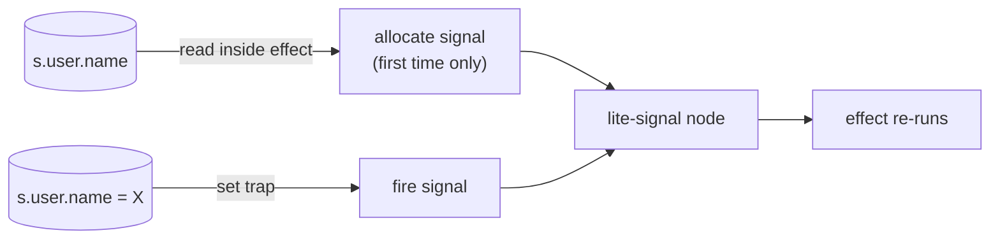

# @zakkster/lite-store

[](https://www.npmjs.com/package/@zakkster/lite-store)
[](https://bundlephobia.com/result?p=@zakkster/lite-store)
[](https://www.npmjs.com/package/@zakkster/lite-store)
[](https://www.npmjs.com/package/@zakkster/lite-store)

[](https://github.com/PeshoVurtoleta/lite-signal)
[](https://opensource.org/licenses/MIT)

**Fine-grained reactivity for objects and arrays, built on `@zakkster/lite-signal`.** Wrap any plain object or array in `store(...)`, mutate it directly, and the renderer/effect/computed reading the specific path you touched re-fires — not every observer of the root, not every observer of the parent. Lazy per-key signals (no allocation outside reactive contexts), stable proxy identity, cycle-safe subtree disposal. Four exports.

```js
import { effect } from '@zakkster/lite-signal';
import { store } from '@zakkster/lite-store';

const s = store({ user: { name: 'Z', age: 36 }, items: [{ id: 1, done: false }] });

effect(() => console.log(s.user.name));       // tracks user.name only

s.user.age = 37;                              // no fire — nobody's reading age
s.user.name = 'X';                            // → "X"
s.items[0].done = true;                       // → still "X" (untracked path)
```

That's the whole pitch: a signal-backed proxy where `store.items[3].done = true` updates only the observers that read that path. No setter ceremony, no path strings, no `setStore('items', 3, 'done', true)` — the proxy lets you mutate the way every other JS developer already does.

---

## Contents

- [Why](#why) · [What it is / is not](#what-it-is--is-not) · [Install](#install) · [Quick start](#quick-start)
- [The model](#the-model) · [Lazy signal allocation](#lazy-signal-allocation) · [Mutation & batching](#mutation--batching) · [Arrays](#arrays)
- [Disposal & cycles](#disposal--cycles) · [Identity guarantees](#identity-guarantees)
- [API reference](#api-reference) · [Recipes](#recipes)
- [Testing (for clients & QA)](#testing-for-clients--qa) · [Running the demo](#running-the-demo)
- [Edge cases & guarantees](#edge-cases--guarantees) · [Ecosystem](#ecosystem) · [FAQ](#faq) · [License](#license)

---

## Why

`signal(...)` from lite-signal is perfect for scalar reactive state — counts, toggles, current values. The moment you try to model anything real — a user object, a todo list, a form, a query cache — you hit the wall: a signal holding `{ items: [...] }` is all-or-nothing. Replace the whole object to update one field, or shatter the state into one signal per leaf and reassemble it manually. Both options cost you the ergonomics that brought you to signals in the first place.

`lite-store` is the missing middle. A proxy wraps your plain object; reads inside an effect become reactive dependencies on *that specific path*; writes through the proxy fan out only to the observers of the touched key. The signal graph stays lazy — a property only becomes reactive once something has actually read it inside a tracking context — so a 10,000-row store with 3 currently-watched fields has 3 signal nodes, not 10,000.



---

## What it is / is not

- **It is** a `Proxy<T>` returned as `T` — direct mutation works, identity is stable (`s.x === s.x`), nested reads compose, `for...of`/`map`/`filter` work. Lazy signal allocation, per-key granularity, sparse-tracked array mutations, cycle-safe disposal. Four-export API.
- **It is not** Immer (no copy-on-write, no `produce` rollback semantics — see [FAQ](#faq)). Not Vuex/Pinia (no actions, no path-string subscriptions, no devtools middleware in v1). Not MobX (no auto-actions, no class decorators). Not Zustand (no setter functions). The mental model is: a plain object that happens to be reactive when read inside a reactive context.

---

## Install

```bash
npm i @zakkster/lite-store @zakkster/lite-signal
```

`@zakkster/lite-signal@^1.1.3` is a **peer dependency** — lite-store depends on the `isTracking()` export added in 1.1.3. ESM-only, ships TypeScript types.

```js
import { store, unwrap, snapshot, dispose } from '@zakkster/lite-store';
```

---

## Quick start

```js
import { signal, effect, computed } from '@zakkster/lite-signal';
import { store } from '@zakkster/lite-store';

const s = store({
    user:  { name: 'Z', age: 36 },
    items: [{ id: 1, done: false }, { id: 2, done: false }],
});

// Read paths inside `effect` to subscribe to them
effect(() => console.log(`hello ${s.user.name}`));

// Derive computed values
const remaining = computed(() => s.items.filter(i => !i.done).length);
effect(() => console.log(`${remaining()} left`));

// Mutate directly — only effects that read the touched path re-fire
s.user.name = 'X';            // → "hello X" (remaining-effect does NOT re-fire)
s.items[0].done = true;       // → "1 left"
s.items.push({ id: 3, done: false });  // → "2 left"
```

---

## The model

A store wraps a plain object or array. Every plain-object or array-typed property accessed through the proxy is itself a proxy of the underlying value, cached so identity is preserved. Every property whose value is a primitive, a function, or a non-plain object (Date, Map, Set, class instance) is returned as-is.

Reads inside a reactive context register a dependency on `(parent-meta, key)`. Writes look up that dependency map and notify the matching effects — *only* the ones that read that specific key on that specific parent. The signal graph stays sparse: a property never read reactively never gets a signal node.

| Operation | What happens |
|---|---|
| `s.user.name` *(inside effect)* | Tracks `(user-meta, "name")`; allocates the signal if absent |
| `s.user.name` *(outside any effect)* | Plain read, **zero allocations** |
| `s.user.name = "X"` | Looks up the signal for `"name"` on `user-meta`; fires it if present |
| `s.user = { name: "Y" }` | Fires the `"user"` signal on the root; recursively disposes the *old* `user` subtree's signals |
| `s.items.push(item)` | Wrapped `push` fires `length` + any tracked tail-index signals, under one batch |
| `s.items[3].done = true` | Two proxy hops; fires `(items[3]-meta, "done")` only |
| `s.foo` *(in effect, foo absent)* | Allocates a signal seeded with `undefined`; firing on later set works |

---

## Lazy signal allocation

The headline performance property: **a property is only assigned a signal node the first time it is read inside a reactive observer.** Every read outside any `effect`/`computed`/`watch` body is a plain property access — no allocation, no bookkeeping, no `lite-signal` pool slot consumed.

```js
const s = store({ a: 1, b: 2, c: 3 });

// 1000 plain reads → zero signals allocated
for (let i = 0; i < 1000; i++) { s.a; s.b; s.c; }
console.log(stats().signals);   // unchanged from before this loop

// One tracked read → one signal
effect(() => s.a);
console.log(stats().signals);   // +1
```

This is the whole point of the design: you pay for what you observe, not for what you store. The test suite proves it directly via `lite-signal`'s `stats()` counter.

---

## Mutation & batching

Direct mutation is the API. Assign, push, splice, delete — every operation a plain JS developer already knows works the same way through the proxy.

```js
s.count++;                                    // fires the "count" signal
s.items.push(item);                           // fires "length" + tracked tail indices
s.items.splice(2, 1);                         // fires "length" + tracked indices ≥ 2
delete s.user.email;                          // fires the "email" signal with undefined
```

For coalescing multiple writes into a single effect fan-out, use `lite-signal`'s `batch(fn)` — same primitive, same semantics, no new API:

```js
import { batch } from '@zakkster/lite-signal';

batch(() => {
    s.items[3].done = true;
    s.user.lastActive = Date.now();
    s.unreadCount = 0;
});
// Every effect that read any of those three paths fires exactly once at the end.
```

There is **no `produce(s, draft => ...)`** in v1. The name borrows Immer's sandbox semantics — "errors mid-write roll back the draft" — and re-implementing that on top of a directly-mutable proxy would require either deep-snapshotting before every call or building Immer underneath the store. The honest answer is that the proxy is mutable; errors during a sequence of writes leave whatever state the partially-applied writes produced, same as any other mutable JS code. A future `transaction(s, fn)` may ship with explicit `snapshot`/restore on throw, with the cost stated upfront at the call site.

---

## Arrays

Every standard mutating array method is intercepted and made reactive: `push`, `pop`, `shift`, `unshift`, `splice`, `reverse`, `sort`, `fill`, `copyWithin`. Each one wraps the underlying `Array.prototype` call in `batch(...)` and then iterates the parent's signal map firing the relevant subset — `length` always, plus any *tracked* indices that the mutation affected. The signal map is already a sparse tracker (lazy allocation guarantees this), so the work scales with `O(tracked indices)`, not `O(array length)`. An array with 10,000 items and 5 observed indices fires at most 5 signals on a `splice(0, 1)`.

Direct index assignment (`s.items[3] = x`) and indexed reads inside effects work as you'd expect. Direct length manipulation also works: `s.items.length = 3` truncates and fires the removed indices' signals; sparse-index writes like `s.items[100] = x` bump length and fire the length signal implicitly.

```js
const s = store({ items: [1, 2, 3, 4, 5] });

effect(() => console.log(s.items[1]));                       // tracks items[1]

s.items[1] = 99;                                             // → 99
s.items.unshift(0);                                          // → 1 (everything shifted)
s.items.splice(0, 2);                                        // → 2 (1 deleted, indices re-shift)
s.items.length = 1;                                          // → undefined (truncated)
```

> **`Map` / `Set` / `Date` / class instances are opaque.** They live in the store as references; mutating them internally (`set.add(x)`, `map.set(k, v)`, `date.setHours(0)`) does **not** fire signals. Replacing the slot — `s.tags = new Set([...])` — does fire the parent key's signal. Reactive `Map` and `Set` are a job for a future `lite-collections` package; folding them into the core would force the Proxy machinery to paper over every native object's internal slots, which is where Vue and Valtio carry significant bundle weight.

---

## Disposal & cycles

When you overwrite a key whose old value was a proxied subtree (`s.user = newUser`), lite-store walks the old subtree's proxy metadata — *not* the raw target — and disposes every signal in the descendant `Map<key, signal>`s, returning them to lite-signal's pool. The walk is `O(tracked nodes)` because the lazy signal map is already sparse: untracked branches contribute nothing.

The walk uses a `Set<meta>` for two purposes:
1. **Cycle termination.** Without it, `s.self = s; s.self = null` would recurse forever.
2. **Initiator skip.** The meta whose set trap initiated the walk is pre-seeded into the `Set`. Without this, breaking a self-cycle would wipe out the very signals the rest of the store is bound to — a subtle bug that surfaces three months later as *"my store stopped reacting after I did X."* The test suite has it as the headline adversarial test (`cycle + overwrite: no stack overflow, no collateral damage on siblings`).

```js
const s = store({ count: 0 });
s.self = s;                                                   // create a cycle
effect(() => console.log(s.count, s.self));                   // tracks count and self
s.self = null;                                                // safe — initiator-skip prevents wiping `count`
s.count = 5;                                                  // ✓ still reactive
```

Orphan cycles with no external reference (`const x = store({}); x.self = x; x = null`) leak — pure reference counting cannot collect them. Document, don't fix in v1.

When you want to release a whole store at known scope boundaries (component unmount, test teardown, query refresh), call `dispose(s)`.

---

## Identity guarantees

A documented invariant: **`s.x === s.x`** within and across ticks. Same target → same proxy, always. This is what makes keyed list reconciliation, memoisation, and `===` comparisons work the way every framework expects.

```js
const s = store({ user: { name: 'Z' } });
console.log(s.user === s.user);                              // true
const cached = s.user;
console.log(cached === s.user);                              // true
s.user.name = 'X';
console.log(cached === s.user);                              // still true — identity is by target
s.user = { name: 'Y' };
console.log(cached === s.user);                              // false — new target, new proxy
```

The corollary is the **zombie proxy**: if you hold a reference to a subtree and then overwrite the parent's key, your reference is still a valid proxy pointing at the (now disposed) target. Reads through it work — they just don't carry any of the original effects' subscriptions. New effects that subscribe to a zombie proxy work normally; they just live on a meta no longer reachable from the root. Documented behaviour, not a bug.

---

## API reference

### `store<T extends object>(initial: T): T`

Wrap a plain object or array in a reactive store. Returns a Proxy typed as `T`. Mutate it normally; reads inside reactive contexts subscribe at the path level. Throws `TypeError` if `initial` is not a plain object or array.

**Idempotent:** passing an existing store returns it unchanged rather than building a proxy-of-a-proxy (which would give one dataset two metas, two signal sets and two identities).

**Frozen subtrees are handed back as-is.** A frozen object's own properties are non-writable and non-configurable, and the proxy `get` invariant then forbids returning a child proxy for them — so frozen data is returned unwrapped and carries no reactivity. It cannot change, so there is nothing to observe; its non-frozen siblings are unaffected.

### `unwrap<T>(s: T): T`

Return the underlying target object. Reads through `unwrap` are NOT tracked, even inside a reactive context. Useful for `JSON.stringify`, `structuredClone`, or any library that doesn't tolerate proxies. Non-stores pass through unchanged.

### `snapshot<T>(s: T): T`

Return a deep plain-data copy of the store's contents. Recursively unwraps nested proxies and clones their targets. Non-plain prototypes (Date, Map, Set, class instances) are copied by reference, not cloned.

**Cycle-safe.** Self-references, mutual references and diamonds resolve to the corresponding clone instead of recursing forever, so the copy reproduces the original's sharing topology rather than exploding it into a tree.

### `dispose(s: object): void`

Release every signal in the store's subtree back to `lite-signal`'s pool. After dispose, further mutations are silent (no signal exists to fire); reads inside new reactive contexts re-allocate signals (zombie reactivation — documented).

### `reconcile<T extends object>(s: T, next: T, opts?): T` <sub>1.1</sub>

Patch `s` in place so its contents deep-equal `next`, touching **only the leaves that actually differ**. This is the answer to the store's worst re-render footgun: `s.items = fresh` disposes every signal under `s.items` and re-fires every observer, even when three fields out of a thousand changed. `reconcile(s.items, fresh)` fires three effects, disposes nothing, and pulls nothing from the pool.

```js
import { store, reconcile } from "@zakkster/lite-store";

const s = store({ items: await fetchRows() });     // 1000 rows

// …later, a refetch returns a brand-new array of brand-new row objects:
reconcile(s.items, await fetchRows());
// rows that didn't change: no fire. rows that did: only the changed field's
// effect re-runs. Every row proxy keeps its identity; no signal is recycled.
```

- **Objects** patch keys present in `next` (recursing into same-shape nested objects/arrays so their identity and signals survive) and delete keys absent from it.
- **Arrays reconcile positionally by default** — index `i` in the store is patched against index `i` in `next`. This is the zero-GC path and covers the dominant case (a refetch that returns the same rows in the same order with a few edited fields).
- **`opts.key`** — a property name (`{ key: "id" }`) or a function (`{ key: r => r.uid }`) — matches rows **by identity** across reorder, insert and removal, so a moved row keeps its whole signal subtree and only its index signal fires. The key applies to every array reached during the walk.
- Runs **untracked** (calling it inside an effect never subscribes) and inside one **`batch`** (a multi-field consumer never sees a torn, half-applied snapshot).
- **Untrusted input is safe by construction.** `next` is a server payload, and `JSON.parse` mints `__proto__` as a real own property — those keys are skipped in both directions, so a hostile refetch never reaches `Object.prototype`.
- **Duplicate keys keep slots disjoint.** When `opts.key` yields the same key for several rows (an overlapping page, a fanned-out join, a server bug), each existing row is claimed by at most one incoming row, so two slots are never backed by one target.

It is not `produce` and not a rollback primitive: there is no draft and no throw-to-discard. `reconcile` is strictly "make the store equal this fresh value, cheaply" — a mid-walk throw leaves the partially-applied writes in place, same as any mutable JS. The **honest non-claim**: keyed reconcile builds a transient `Map`/`Set`/scratch array (JS-heap handles the pool counters don't see); positional reconcile of a same-shape refetch allocates nothing on either the pool or the JS heap.

---

## Recipes

**Todo list** — direct mutation drives all the reactivity:

```js
const todos = store({
    items: [],
    filter: 'all',
});
const visible = computed(() => {
    if (todos.filter === 'all')    return todos.items;
    if (todos.filter === 'active') return todos.items.filter(t => !t.done);
    return todos.items.filter(t => t.done);
});

function add(text)   { todos.items.push({ id: Date.now(), text, done: false }); }
function toggle(id)  { const t = todos.items.find(t => t.id === id); if (t) t.done = !t.done; }
function clear()     { todos.items = todos.items.filter(t => !t.done); }
```

**Form state with nested validation** — every field is its own subscriber:

```js
const form = store({
    fields: { name: '', email: '' },
    errors: { name: null, email: null },
});

effect(() => {
    form.errors.name  = form.fields.name.length  < 2 ? 'too short' : null;
    form.errors.email = !form.fields.email.includes('@') ? 'invalid' : null;
});
```

**Save to lite-persist** — `unwrap` is the persistence boundary:

```js
import { persist } from '@zakkster/lite-persist';
const s = store({ count: 0, items: [] });
persist(() => snapshot(s), 'my-store');                      // serialises clean data
```

**Cross-tab sync with lite-channel** — pair store with channel for multi-tab state:

```js
import { syncSignal } from '@zakkster/lite-channel';
const s = store({ count: 0 });
const remote = syncSignal('count', s.count);
effect(() => remote.set(s.count));
effect(() => { s.count = remote(); });
```

---

## Testing (for clients & QA)

```bash
npm test     # node --test test/*.test.js
```

**75 deterministic tests**, all green. The lazy-allocation claim is proven directly via `lite-signal`'s `stats()` counter (no signal nodes allocated for plain reads); the headline adversarial test (`cycle + overwrite`) verifies all three pass conditions — no stack overflow, no spurious effect runs, and *crucially* that sibling signals survive the cyclic disposal walk.

| Group | What's pinned down |
|---|---|
| Construction | Wraps plain objects, arrays, nested structures; rejects non-plain inputs |
| Identity | `s.x === s.x` across reads, captured refs, and through unrelated mutations |
| Reactivity basics | Tracks reads, fires only matching writes, `Object.is` short-circuit |
| **Lazy allocation** | Plain reads allocate zero signals (verified via `stats()`); tracked reads allocate one per key |
| **Cycle adversarial** | `s.self = s; s.self = null` doesn't blow the stack or wipe sibling signals; 3-node cycles terminate |
| **Computed integration** | Memoisation, dynamic dep sets across conditional branches, two computeds sharing a source, error caching with recovery |
| Property add/delete | Adding new properties fires tracking effects; delete fires `undefined`; non-existent delete is a no-op; explicit `= undefined` distinct from delete |
| **Self-assignment** | `s.a = s.a` is a no-op — does NOT dispose `s.a`'s subtree |
| Array ops | `push`, `pop`, `shift`, `unshift`, `splice` (forward/negative/insert-only/empty), `reverse`, `sort`, `fill` — each fires the right subset of tracked indices + length |
| **Array length** | `arr.length = N` truncation fires removed indices; sparse `arr[100] = x` fires length implicitly |
| **Array iteration** | `for...of`, `forEach`, `map`, `find` (short-circuits correctly), spread `[...arr]` — all track every visited index |
| **Object iteration** | `JSON.stringify`, spread `{...s}`, `Object.values` track read keys; `'key' in s` (has trap) tracks **presence**, so a value change does not wake it |
| **Multi-store** | Independent stores don't cross-fire; effects/computeds composing two stores re-fire correctly |
| Dispose | Sibling safety; 500-child cascade; idempotent (double-dispose safe); during-batch; non-store inputs |
| Zombie proxy | Old effects detached; new effects can re-subscribe to a zombie subtree |
| **Shared subtree** | `s.a = s.b` shares the meta; mutations visible from both paths |
| Boundaries | Date / Map / Set / class instances opaque; mutating internals doesn't fire |
| **Error handling** | Effect throws don't break siblings; computed errors cached and clear on dep change; bounded recursion |
| Utilities | `unwrap` returns target; `snapshot` deep-clones (structurally equal, identity-distinct, non-reactive, cycle-safe) |
| **Torture** | Adversarial regression suite (`test/Torture.test.js`): every array-shrink path returns its nodes under a fixed-ceiling registry; duplicate-key slot disjointness; `__proto__` payloads inert; snapshot cycles; `store()` idempotency; stable array-method identity; `in` subscribes to presence only (value change does not wake it; presence flip wakes it once); ToUint32 `length`; frozen containers |

A clean run prints `# pass 129 / # fail 0`.

---

## Running the demo

```
example/demo.html
```

Open it directly — no build, no server. A 600-cell reactive grid driven by a single nested store. Mutate one cell, ten cells, or all 600; the stats panel shows you the effect-run count in real time. Mutating one cell runs one effect. Mutating all 600 runs all 600. The fine-grained reactivity story made visible.

---

## Edge cases & guarantees

- **Identity is by underlying target.** `s.x === s.x` holds across reads, ticks, and unrelated mutations. `s.x === captured` only stops holding when you overwrite `s.x` with a different target.
- **Lazy allocation, not eager.** A property has no signal node until it's read inside a reactive observer. `stats().signals` is your verification.
- **`O(tracked)` array mutations.** Splice/shift/sort/etc. walk the parent's signal map, which is already sparse. An array with 10,000 elements and 3 observed indices fires at most 3 signals on a splice.
- **Cycle-safe overwrites.** Self-references and back-references survive overwrites without stack overflow or sibling collateral damage. Pure orphan cycles (no external reachability) leak.
- **Opaque non-plain values.** Date, Map, Set, RegExp, class instances are referenced, not wrapped. Mutating their internals is not reactive; replacing the slot is.
- **Direct mutation, errors don't roll back.** A thrown error mid-sequence leaves the store in the partially-applied state. Use `batch(...)` for coalescing only; for rollback semantics, wait for `transaction(s, fn)` in 1.x or do a manual `snapshot`/restore.

---

## Ecosystem

Zero-GC reactive toolkit; each package independent and MIT-licensed:

- **[@zakkster/lite-signal](https://www.npmjs.com/package/@zakkster/lite-signal)** — the reactive core (peer dependency; ^1.1.3 required for `isTracking()`).
- **[@zakkster/lite-watch-ex](https://www.npmjs.com/package/@zakkster/lite-watch-ex)** — `watchOnce`, `watchUntil`, `watchEffect` (Vue ergonomic).
- **[@zakkster/lite-raf](https://www.npmjs.com/package/@zakkster/lite-raf)** — frame scheduler.
- **[@zakkster/lite-resource](https://www.npmjs.com/package/@zakkster/lite-resource)** — async state as a signal.
- **[@zakkster/lite-channel](https://www.npmjs.com/package/@zakkster/lite-channel)** — cross-tab signal sync.
- **[@zakkster/lite-persist](https://www.npmjs.com/package/@zakkster/lite-persist)** — persist signals to storage.
- **[@zakkster/lite-router](https://www.npmjs.com/package/@zakkster/lite-router)** — URL as a signal.
- **[@zakkster/lite-scene](https://www.npmjs.com/package/@zakkster/lite-scene)** — reactive Canvas2D scene graph.
- **@zakkster/lite-store** *(this package)* — fine-grained reactivity for objects and arrays.

---

## FAQ

**Why no `produce(s, draft => ...)` like Immer?**
The name borrows Immer's sandbox guarantee — "draft is isolated; success commits, throw discards." Re-implementing that on a directly-mutable proxy means either deep-snapshotting before every call (allocation a clone for the throw case that almost never fires) or building Immer underneath. Both trade the brand for an expectation borrowed from a different mental model. Use `batch(fn)` from lite-signal for coalescing; for rollback, a future `transaction(s, fn)` will ship with the cost stated at the call site.

**Why is `Map` / `Set` opaque?**
Because making them reactive correctly requires intercepting their internal slot operations — what V8 / SpiderMonkey treat as private state — and paper-overing the differences between native and proxied behaviour. Vue and Valtio both ship significant complexity (and bundle weight) for this. The opt-in path is `lite-collections` with `ReactiveMap` / `ReactiveSet` that implement the same interfaces while calling `lite-signal` directly. Until that lands, replace the slot to fire.

**How does this compare to Solid stores?**
Same proxy + lazy-signal foundation; different API surface. Solid uses `setStore('path', 'to', 'value', x)` to avoid TypeScript inference headaches around proxies — clean but path-string heavy. lite-store types the proxy directly as `T`, so `s.path.to.value = x` typechecks normally and reads like plain JS.

**How does this compare to Valtio?**
Closest cousin. Both use direct mutation through a Proxy. Differences: lite-store is signal-native (composes with `effect`/`computed`/`watch` from lite-signal — same primitive your other reactive code already uses), Valtio is subscription-native (uses `useSnapshot` / `subscribe`); lite-store has no framework affinity, Valtio's React integration is the headline; lite-store is opaque-by-default for Map/Set, Valtio wraps them.

**Will this scale to thousands of fields?**
For static stores, yes — proxy creation is lazy (WeakMap-cached), signal allocation is lazy. Pressure point is the number of *active* signals, which equals the number of tracked paths. A 10,000-row table with 50 currently-visible rows has ~50 row-effects worth of signals. For very large dynamic stores, bump lite-signal's registry cap with `setDefaultRegistry(createRegistry({ maxNodes: 16384 }))`.

**What happens to held references after dispose?**
The "zombie proxy" case: reads through a held reference still return values from the underlying target; writes still mutate the target. But the original effects' subscriptions were severed when the signals went back to the pool. New effects can subscribe to the zombie proxy and will work normally — they just live on metadata no longer reachable from any store root. Documented, not a bug.

---

## License

MIT © Zahary Shinikchiev
